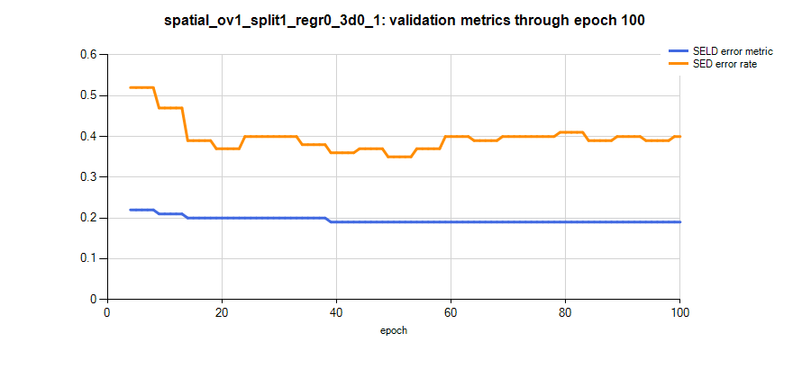

# SELD4CCTV: Audio-Guided Smart CCTV for Public Safety

## 개요

이 저장소는 CCTV 형태의 4채널 공간 마이크 배열에 맞게 SELDnet을 적용한 프로젝트입니다. 현재 파이프라인은 CRNN 모델을 학습하여 다음 작업을 수행합니다.

- SED: 공공 안전 관련 음향 이벤트 탐지
- SELD: 음향 이벤트 탐지와 위치 추정을 결합한 통합 추론

## 데이터셋

공간 음향 데이터셋은 비공간 공공 안전 음원 데이터를 CCTV 장착 마이크 배열에서 관측되는 소리처럼 시뮬레이션하여 생성했습니다. 원본 음원은 AudioSet과 Enhanced Audio of Accident and Crime Detection 데이터셋에서 가져왔으며, breaking, burst, car crash, gunfire, screaming, shouting 등의 클래스를 포함합니다.

공간화 과정은 NVIDIA Omniverse에서 수행했습니다. 가상 장면의 물리 기반 음향 전파 효과를 원본 mono/non-spatial audio에 적용하여, 거리 기반 감쇠, 마이크 간 도달 지연, source/listener geometry에 따른 Doppler 효과를 반영했습니다. 따라서 각 샘플은 이벤트 종류뿐 아니라 SELD 학습에 필요한 공간 단서를 함께 포함합니다.

생성된 데이터셋은 다음과 같은 4채널 CCTV cross-array 마이크 레이아웃을 사용합니다.

```text
CCTV_Mic_Top | CCTV_Mic_Bottom | CCTV_Mic_Left | CCTV_Mic_Right
```

현재 로컬 source manifest 기준 샘플 수, 클래스별 분포는 다음과 같습니다.

| Class | Train | Test |
| --- | ---: | ---: |
| breaking | 157 | 39 |
| burst | 413 | 103 |
| car_crash | 1,320 | 330 |
| gunfire | 1,666 | 417 |
| screaming | 908 | 227 |
| shouting | 303 | 75 |

## 실험 설정

본 모델의 기본 실험 설정은 다음과 같습니다.

| 항목 | 값 |
| --- | --- |
| 데이터셋 | `spatial` |
| Overlap / split / dB | `1 / 1 / 0` |
| Quick test | `False` |
| DOA 모드 | Full XYZ regression (`azi_only=False`) |
| FFT | `512` |
| Sequence length | `512` |
| Batch size | `16` |
| CNN filters | `64` |
| Pooling | `[8, 8, 2]` |
| RNN | Bidirectional GRU `[128, 128]` |
| FNN | `[128]` |
| Loss weights | `[0.1, 50.0]` for SED and DOA |
| Optimizer | Adam, learning rate `1e-4`, clipnorm `1.0` |
| Max epochs | `100` |
| Validation interval | 매 `5` epoch |
| LR schedule | 검증 성능이 `3`회 개선되지 않으면 learning rate를 절반으로 감소, 최소값 `1e-6` |
| Checkpoints | best 및 last `.keras` 파일 저장 |

## 실험 결과

아래 그래프는 본 실험 세팅 기반 모델 학습의 100 epoch까지 주요 validation metric입니다.



로그 기준으로 첫 100 epoch 내 최고 validation 지점은 epoch 49에서 관찰되었습니다.

| Run | Best epoch | SELD error | SED ER | DOA error GT | DOA error Pred | Good peaks ratio |
| --- | ---: | ---: | ---: | ---: | ---: | ---: |
| `spatial_ov1_split1_regr0_3d0_1` | 49 | 0.19 | 0.35 | 0.68 | 0.58 | 0.97 |

SELD error metric은 초반에 빠르게 개선된 뒤 약 0.19 수준에서 안정화되었고, SED error rate는 첫 100 epoch의 중반부에서 가장 낮은 구간에 도달했습니다.
